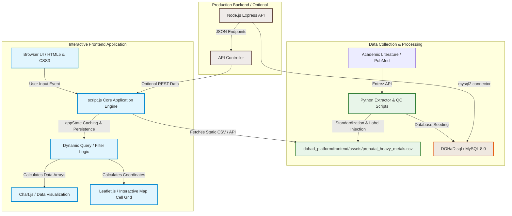
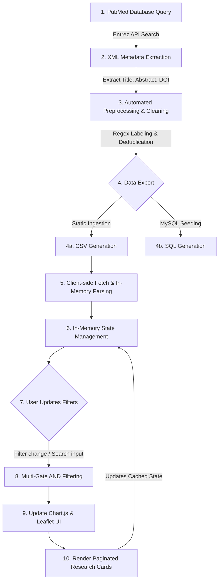

# 🧬 DOHaD Exposure Intelligence Platform
### *A high-fidelity research metadata curation, analytics, and intelligence platform mapping early-life environmental toxicant exposures to chronic disease susceptibility.*

---

[](https://www.python.org/)
[](https://developer.mozilla.org/en-US/docs/Web/JavaScript)
[](https://nodejs.org/)
[](https://expressjs.com/)
[](https://www.mysql.com/)
[](https://www.chartjs.org/)
[](https://leafletjs.com/)
[](https://pubmed.ncbi.nlm.nih.gl/)
[](https://www.dohadsoc.org/)
[](LICENSE)

---

# 📖 Overview

The **Developmental Origins of Health and Disease (DOHaD)** paradigm provides first evidence that the environment in the early life; sensitive window (prenatal and early postnatal period) cross that imprint our body structure and function and pre-dispose us to obesity, cardiovascular and non-communicable diseases in our later stage of life.

 The most highly toxic, persistent and widespread of environmental risks are metalloid and heavy metal (including Arsenic, Cadmium, Lead and Mercury). Because these toxicants easily cross the maternal-fetal barrier early-life exposure could cause mass deregulation of epigenetic programming, energy metabolism and organogenesis.

 While the need for DOHaD is undeniable,  what exists in the scientific literature is somewhat sporadic.  There are thousands of toxicology articles released in loosely-indexed,  informal institutions,  tables, and books and under very general ‘medical headlining’ terms.  This presents increasingly difficult challenges for behavioral epidemiologists and policy-makers to filter through as it directly pertains to trends of articles across the hundreds of thousands of publications,  to policesin the public population for exposures, or as an input for a meta-analysis.

This fragmentation is countered through a common repository and analytical platform,  the DOHaD Exposure Intelligence Platform. It is a coherent, quality-controlled research database, multi-dimensional filter, and visualization interface. Bridging the gap between publications in papers and epidemiological knowledge.

---

# ✨ Key Features

| Feature Group | Description | Included Capabilities |
| :--- | :--- | :--- |
| **🔍 Search & Filter** | Precise, multi-level criteria matching | • Automated PubMed metadata extraction<br>• AND-logic filtering across five metadata fields<br>• Dynamic keyword search inside titles and abstracts |
| **📊 Visual Analytics** | Interactive graphs for data trends | • Temporal publication trends via Line Charts<br>• Toxicant distribution analysis<br>• Organ-wise toxicity tracking<br>• Dose-response distribution mapping |
| **🗺️ Geographic Mapping** | Real-time geospatial distribution | • Dynamic Leaflet-based interactive maps<br>• Regional study mapping per toxicant |
| **⚡ Architecture** | Lightweight and performant design | • Client-side static memory querying via CSV<br>• Relational SQL option for larger scale storage<br>• Persisted filter states using session memory |

---

# 🏗️ System Architecture

The DOHaD Exposure Intelligence Platform is designed with a decoupled architecture. This allows for both lightweight static deployments (loading preprocessed datasets client-side via JavaScript) and database-backed enterprise environments (powered by Node.js, Express, and MySQL).



---

# 📂 Project Structure

The project repository is structured to separate production source files, database schemas, and scripting utilities:

```directory
dohad_platform/
├── backend/                  # Production API (Node.js/Express)
│   ├── package.json
│   ├── package-lock.json
│   └── server.js             # API entry point & user login authentication routes
├── database/                 # MySQL database files
│   └── DOHaD.sql             # SQL DB installation schemas and seed datasets
├── frontend/                 # Client-side web application source files
│   ├── css/
│   │   ├── auth.css
│   │   └── style.css         # Main platform design system
│   ├── js/
│   │   └── script.js         # Core application logic, charts, and filter engine
│   ├── assets/               # Unified operational datasets and graphic elements
│   │   ├── prenatal_heavy_metals.csv
│   │   ├── landscape_infographic.png
│   │   └── vision_clean.png
│   ├── index.html            # Main platform homepage & news feed
│   ├── database.html         # Advanced research search database
│   ├── analytics.html        # Interactive data analytics suite
│   ├── auth.html             # User login and account signup portal
│   ├── news.html             # Live medical/health headline feeds
│   ├── team.html             # Research group page
│   └── about.html            # Documentation of project dataset demographics
└── scripts/                  # Curation, parsing, and data cleaning utilities
    ├── build_hybrid.py       # Rebuilds index.html and standalone pages
    ├── create_dohad_db.py    # Python script loading CSV data to local MySQL
    ├── create_dohad_sql.py   # Code generator parsing CSV and writing SQL scripts
    ├── fix_navs.py           # Navbar sync utility
    ├── fix_nav_order.py      # Navbar order and active link formatter
    ├── inject_labels.py      # Cleans CSV strings and maps affected organs
    └── inject_refresh.py     # Updates CSV indices with updated source files
```

---

# ⚙️ Technology Stack

| Architecture Layer | Technology | Library / Package | Implementation Detail |
| :--- | :--- | :--- | :--- |
| **Frontend Core** | HTML5 / CSS3 / ES6+ JavaScript | Vanilla JS / Google Fonts | Semantic markup, responsive flexbox layout, custom typography |
| **Interactive UX** | GSAP (GreenSock) | `gsap.min.js`, `ScrollTrigger.min.js`, `lenis.min.js` | Smooth scrolling, scroll-triggered fade animations, magnetic cursor feedback |
| **Visual Analytics** | Chart.js / Leaflet | `chart.js`, `leaflet.js` | Live charts rendering, custom interactive pie-chart events, geospatially plotted data |
| **Backend API** | Node.js / Express | `express`, `cors`, `bcrypt` | REST endpoints for data extraction, secure sign-up/login password hashing |
| **Database** | MySQL 8.0 | `mysql2` | Relational database engine, schemas with multi-table database queries |
| **Data Pipelines** | Python 3 | `re`, `shutil`, `glob`, `mysql.connector` | Scripting for cleaning CSV metadata, automated updates, and mapping organs |

---

# 🔬 Scientific Background

```
                              ┌────────────────────────────────────────┐
                              │ Early-Life Environmental Toxicants     │
                              │ (Lead, Mercury, Cadmium, Arsenic)      │
                              └───────────────────┬────────────────────┘
                                                  │
                                                  ▼
                              ┌────────────────────────────────────────┐
                              │ Placental Transfer & Fetal Exposure    │
                              └───────────────────┬────────────────────┘
                                                  │
                                                  ▼
                              ┌────────────────────────────────────────┐
                              │   Disrupted Epigenetic Programming     │
                              │   (DNA methylation / Histone mods)     │
                              └───────────────────┬────────────────────┘
                                                  │
                              ┌───────────────────┴────────────────────┐
                              ▼                                        ▼
               ┌─────────────────────────────┐          ┌─────────────────────────────┐
               │    Altered Organogenesis    │          │    Endocrine Disruption     │
               └──────────────┬──────────────┘          └──────────────┬──────────────┘
                              │                                        │
                              └───────────────────┬────────────────────┘
                                                  │
                                                  ▼
                              ┌────────────────────────────────────────┐
                              │  Permanent Alterations in Physiology   │
                              └───────────────────┬────────────────────┘
                                                  │
                                                  ▼
                              ┌────────────────────────────────────────┐
                              │    Increased Chronic Disease Risk      │
                              │  (Neuro, Cardio, Renal Pathologies)    │
                              └────────────────────────────────────────┘
```

The scientific basis of this project rests on several key areas of developmental toxicology and environmental health:

### 1. The DOHaD Hypothesis
Organisms are highly sensitive to their environment during early development. Environmental stressors (such as nutrition or toxicants) can trigger permanent changes in physiology and structure through **fetal programming**. These shifts, while sometimes serving as immediate adaptations to survive in-utero stress, often lead to a mismatch with the postnatal environment, increasing the risk of chronic diseases in adulthood.

### 2. Epigenetic Modifications
Heavy metals do not necessarily alter DNA sequences directly. Instead, they interfere with epigenetic mechanisms. Prenatal metal exposure can alter **DNA methylation patterns**, modify **histones**, and disrupt **non-coding RNA expression**. These changes can silenece or overexpress genes regulating cellular differentiation, leaving a molecular footprint that persists throughout the individual's life.

### 3. Fetal Organogenesis & Tissue-Specific Vulnerability
During gestation, organs develop at different rates. Exposure to developmental toxicants during these precise windows can disrupt tissue development:
*   **Neurodevelopment:** Metals like Lead and Mercury easily cross the blood-brain barrier, altering synaptic connectivity and neural stem cell differentiation.
*   **Cardiovascular System:** Arsenic exposure impairs endothelial function and microvascular development, laying the groundwork for adult hypertension and cardiovascular disease.
*   **Renal Development:** Cadmium accumulates in the developing renal cortex, reducing nephron endowment and predisposing individuals to chronic kidney disease (CKD).

---

# 📚 Literature Collection Pipeline & Data Workflow



The dataset is maintained and queried using an automated pipeline designed to retrieve, parse, and structure academic literature before feeding it into the interactive frontend:

1.  **Entrez API Querying:** Python scripts query the NCBI Entrez Utilities to pull relevant literature. The search query targets research containing key terms: `(prenatal OR developmental OR in utero) AND (heavy metals OR arsenic OR lead OR mercury OR cadmium) AND (toxicity OR outcomes)`.
2.  **XML Parsing:** The Entrez server returns raw XML files. Python's XML parsing libraries extract metadata fields, including the PubMed ID (PMID), Title, Abstract, Journal, Year of Publication, and DOI.
3.  **Data Enrichment:** Using regex pattern matching, scripts inspect titles and abstracts to pre-classify:
    *   *Species:* Categorized as `Human` or `Animal` based on keyword lists (e.g., *murine, rat, mouse, pregnancy, cohort*).
    *   *Exposure Window:* Flagged as `Prenatal` or `Developmental`.
    *   *Organ System:* Mapped to specific organ categories (e.g., *brain, kidney, liver, heart, lung*) if relevant vocabulary is detected in the text.
4.  **Export:** The pipeline generates both a unified CSV (`prenatal_heavy_metals.csv`) and a formatted SQL script (`DOHaD.sql`) with pre-constructed INSERT statements for database deployment.
5.  **Interactive Workflow:** Once exported, the data is fetched into memory client-side. When the user interacts with the UI, the engine rapidly filters the dataset and re-renders the charts and study cards dynamically.

---

# 📊 Metadata Captured

The platform processes and displays the following metadata schema:

| Field Name | Data Type | Database Column | Frontend Property | Description / Extraction Criteria |
| :--- | :--- | :--- | :--- | :--- |
| **PubMed ID** | `VARCHAR(20)` | `pmid` | `item.pmid` | The unique identifier assigned by NCBI's PubMed database. |
| **Title** | `TEXT` | `title` | `item.title` | Full title of the peer-reviewed research publication. |
| **Abstract** | `LONGTEXT` | `abstract` | `item.abstract` | Complete article abstract (used for deep keyword searching). |
| **Journal** | `VARCHAR(255)` | `journal` | `item.journal` | Publishing scientific journal. |
| **Year** | `INT` | `year` | `item.year` / `_numericYear` | Year of publication (used for time-series trend analysis). |
| **Toxicant** | `VARCHAR(50)` | `toxicant` / `metal` | `item.metal` | The heavy metal studied: `Arsenic`, `Cadmium`, `Lead`, or `Mercury`. |
| **Dose** | `VARCHAR(100)`| `dose` | `item.dose` | The experimental or environmental dose levels reported. |
| **Exposure Window**| `VARCHAR(100)`| `exposure_window`| `item.exposure_window` | The target developmental stage (e.g., `Prenatal`, `Developmental`). |
| **Species** | `VARCHAR(50)` | `species` | `item.species` | The model organism class: `Human` or `Animal`. |
| **Country** | `VARCHAR(100)`| `country` | `item.country` | Country where the research cohort or experimental study was located. |
| **Target Organ** | `TEXT` | `organ` | `item.organ` | Organ systems analyzed (e.g., `Brain`, `Kidney`, `Liver`, `Heart`, `Lungs`). |
| **Outcome** | `TEXT` | `key_finding` / `outcome` | `item.outcome` | Key toxicological finding or biological outcome observed. |
| **DOI** | `VARCHAR(255)`| `doi` | `item.doi` | Digital Object Identifier linking directly to the publisher's site. |
| **Article Type** | `VARCHAR(50)` | `article_type` | `item.article_type` | Categorization of the paper structure: `Research` or `Review`. |

---

# 🧹 Quality Control

To ensure the integrity of the data used for visualizations and search tools, the preprocessing pipeline applies several validation steps:

*   **BOM Correction:** Removes the UTF-8 Byte Order Mark (`\uFEFF`) from raw files, which can otherwise corrupt CSV headers in memory.
*   **Strict Column Alignment:** Standardizes column names across files (e.g., aliasing `dose (ppm)` to `dose` and `organs` to `organ`).
*   **Type Coercion:** Casts publication years to numeric integers (`_numericYear`) to ensure numerical filtering works correctly.
*   **Duplicate Filtering:** Uses the unique PubMed ID (`pmid`) as a primary key to deduplicate records during updates.
*   **String Sanitization:** Trims whitespace and strips unescaped double quotes that could break standard CSV line readers.

---

# 💾 Data Storage

The platform supports two storage methods, balancing simplicity with scalability:

### 1. Flat-File Storage (Static Deployment)
*   **Format:** Structured CSV file (`prenatal_heavy_metals.csv`) stored in `frontend/assets/`.
*   **In-Memory Querying:** Loaded client-side via a fetch request. A custom, quote-aware parsing engine processes the CSV in the browser.
*   **Advantage:** Allows the platform to run serverless, making it easy to deploy on static hosts like GitHub Pages.

### 2. Relational Database (Enterprise Deployment)
*   **Format:** Relational MySQL schema (`DOHaD` and `dohad_auth` databases).
*   **Server Stack:** Node.js Express server running on port `3000` using the `mysql2` driver.
*   **Database Tables:**
    *   `arsenic_prenatal`: Stores detailed data for prenatal arsenic exposure.
    *   `cadmium`: Stores cadmium toxicology metrics.
    *   `all_papers` (VIEW): Dynamically joins (`UNION ALL`) toxicant tables, creating a unified view for broad database queries.
    *   `dohad_auth.login details`: Stores user credentials with passwords hashed using `bcrypt` (10 salt rounds).

```sql
-- Conceptual DOHaD VIEW Schema
CREATE VIEW all_papers AS
SELECT pmid, title, abstract, journal, year, 'Arsenic' AS metal, dose, exposure_window, key_finding AS outcome, country, organ, source_file FROM arsenic_prenatal
UNION ALL
SELECT pmid, title, abstract, journal, year, 'Cadmium' AS metal, dose, exposure_window, key_finding AS outcome, NULL AS country, organs_detected AS organ, source_file FROM cadmium;
```

---

# 🔎 Filtering Engine

The search and filtering logic operates client-side to provide responsive results as users type or change criteria:

```
                  ┌───────────────────────────────┐
                  │ Global In-Memory Dataset      │
                  │ (appState.data Array)         │
                  └───────────────┬───────────────┘
                                  │
                                  ▼
                     [applyFilters() Execution]
                                  │
         ┌────────────────────────┼────────────────────────┐
         ▼                        ▼                        ▼
┌─────────────────┐      ┌─────────────────┐      ┌─────────────────┐
│ Search Keyword  │      │ Dropdown Select │      │ Numeric Range   │
│ Match: Title /  │  AND │ Matches: Metal, │  AND │ Validation:     │
│ Abstract /      │      │ Species,        │      │ Year Range      │
│ Outcome String  │      │ Country, Stage  │      │                 │
└────────┬────────┘      └────────┬────────┘      └────────┬────────┘
         │                        │                        │
         └────────────────────────┼────────────────────────┘
                                  │
                                  ▼
                  ┌───────────────────────────────┐
                  │ Target Result Set             │
                  │ (appState.filteredData)       │
                  └───────────────────────────────┘
```

*   **AND-Gate Logic:** The application applies all active filters simultaneously. A record is only included in the output if it meets every selected criteria.
*   **Deep Keyword Search:** The search input compares terms against the title, key findings, and abstract text, returning matches regardless of letter case.
*   **Exposure Period Extraction:** If a user filters by exposure window, the engine runs text matches on the title and key findings to identify relevant studies.
*   **Article Type Detection:** Filters partition the dataset into `Research` or `Review` by analyzing metadata tags and checking titles for keywords (e.g., searching for "review").
*   **State Persistence:** Active filter criteria are serialized and saved to the browser's `sessionStorage`. This maintains the user's focus state when navigating between pages (e.g., index, database, analytics).

---

# 📈 Analytics Dashboard

The **Analytics Dashboard** (`analytics.html`) renders interactive charts using the filtered dataset to visualize trends:

### 1. Studies per Year (Line Chart)
*   **X-Axis:** Years of Publication | **Y-Axis:** Total Volume of Studies
*   **Scientific Value:** Tracks the history of DOHaD research, showing how interest in developmental toxicology has grown over time.

### 2. Heavy Metal Distribution (Pie Chart with Interactive Overlay)
*   **Structure:** Segmented by toxicant types (Arsenic, Cadmium, Lead, Mercury).
*   **Interactive Mappings:** Clicking a slice filters the dataset by that metal and opens a custom pop-up showing organ involvement (Heart, Lungs, Liver, Kidney, Brain) for that toxicant.
*   **Scientific Value:** Quickly highlights which toxicants have been studied most, and which organ systems are most frequently associated with their toxicity.

```
       [ Pie Chart Slice Click Event ]
                      │
                      ▼
        Extract Selected Metal Name
                      │
                      ▼
   Scan appState.filteredData for Matches
                      │
                      ▼
     Parse "organ" column text per row
                      │
                      ▼
     Increment organ system counters
  (counts.heart, counts.lungs, counts.brain...)
                      │
                      ▼
  Inject results into body-parts-overlay Table
```

### 3. Dose Distribution (Faceted Grid)
*   **Structure:** Four separate bar charts, one for each metal, showing exposure doses.
*   **Scientific Value:** Helps researchers compare exposure ranges across studies and identify common dose thresholds.

### 4. Geographic Distribution (Leaflet Map Cells)
*   **Structure:** A grid of interactive mini-maps.
*   **Scientific Value:** Shows where research cohorts and studies are located globally, highlighting geographic areas that may need more study.

---

# 🎨 User Interface & Experience

The platform is designed to look clean, professional, and modern, using vanilla frontend technologies:

*   **Responsive Layout:** Uses CSS Grid and Flexbox to adapt the interface across mobile devices, tablets, and wide desktop screens.
*   **Sleek Styling:** A modern, clinical color palette built around custom CSS variables (deep slate, cool blues, and vibrant highlight accents).
*   **GSAP Animations:** Animates cards as they load into the results grid, providing smooth transitions without impacting performance.
*   **ScrollTrigger:** Fades and slides page sections into view as the user scrolls, creating a polished, cohesive presentation.
*   **Lenis Smooth Scroll:** Standardizes scrolling behavior across different browsers and devices for a consistent user experience.

---

# 🚀 Future Scope

*   **Vector Embeddings & Semantic Search:** Plan to integrate a lightweight vector search library (like `transformers.js`) to allow users to search by conceptual meaning rather than exact keywords (e.g., linking "neurodevelopmental deficits" with "cognitive delay").
*   **Automated Literature Updates:** Planning to schedule backend cron jobs that run the Python Entrez parser weekly, ensuring the database stays up to date automatically.
*   **Extended Metal Profiles:** Expand the database schema to include other developmental toxicants, such as Chromium, Nickel, and organic pollutants.

---

# 🤝 Contribution Guidelines

We welcome contributions from researchers, toxicologists, and software developers. 

1.  **Fork the Repository:** Create a personal copy of the project on GitHub.
2.  **Create a Feature Branch:** `git checkout -b feature/your-feature-name`.
3.  **Adhere to Standards:** Ensure code updates follow the existing structure and do not introduce errors.
4.  **Open a Pull Request:** Provide a clear description of the changes and the problem they solve.

For scientific corrections (such as updating metadata classifications), please open an issue with the relevant PubMed ID (PMID) and citation.

---

# 📜 License

Distributed under the MIT License. See `LICENSE` for more information.

---

# 🙏 Acknowledgements

*   **NCBI PubMed / Entrez Utilities:** For providing the API infrastructure that powers our literature collection.
*   **The DOHaD Society:** For establishing the scientific framework and research foundations that inspired this platform.
*   **The Open-Source Community:** For providing the libraries (Chart.js, Leaflet, GSAP) that power our visualizations and interface.

---

# 📬 Contact

*   **Project Lead:** Academic Research Group
*   **Email:** [info@dohadplatform.org](mailto:info@dohadplatform.org)
*   **Institution:** DOHaD Exposure Intelligence Research Initiative
